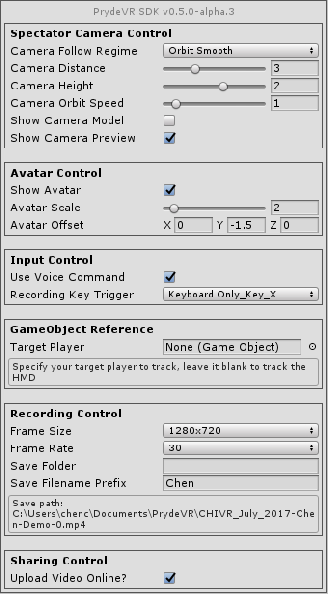
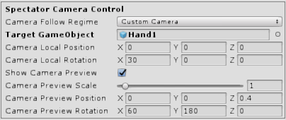
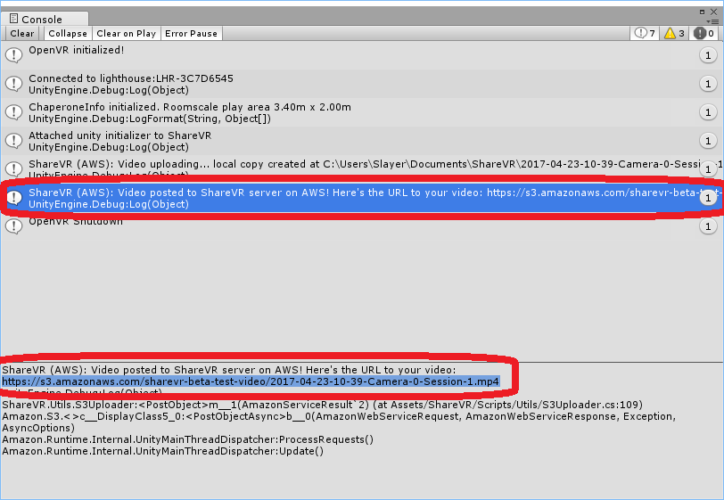

<center>
  
</center>

# PrydeVR Unity Plugin v0.5.3-alpha.1
Welcome to PrydeVR Unity plugin release. Thanks for taking time trying out our plugin. This quick start tutorial will help you quickly setup our plugin. If you have any question, please don't hesitate to contact us at [dev@prydevr.com](mailto:dev@prydevr.com)

## Tested Environment
- Unity Engine >= 5.6, 2017.1+
- OpenVR supported HMDs
  - HTC Vive
  - Oculus Rift
  - *etc.*

## Getting Started
PrydeVR's features does not require SteamVR. However, we did included an example scene adopted from SteamVR's interaction system testing scene to help you get familiarize with PrydeVR so *it's recommended to have the [SteamVR](https://www.assetstore.unity3d.com/en/#!/content/32647) plugin loaded in your project.* To start, please check out our [quick installation video on YouTube](https://www.youtube.com/watch?v=UP00JfT9UtU).

Keep in mind that all of PrydeVR's features does not require SteamVR.

### Import PrydeVR and Load the Example Scene
1. Make sure you have [SteamVR](https://www.assetstore.unity3d.com/en/#!/content/32647) plugin in your project (Required only for the example scene)
2. Import the PrydeVR Unity Plugin (currently distributed as a separate UnityPackage)
3. Under _Assets/PrydeVR/Scenes/_, open the example scene
4. Hit play to start the demo
   - You should be able to see a big panel in front of you called _PrydeVR Live View Panel_. The panel will stream PrydeVR's camera view so you can clearly see what's going on
   - We've configured PrydeVR camera using the _Orbit Smooth_ mode. You should be able to see a small camera preview panel floating in the air that is orbiting around you. If you find it, say hi to our VR camera rig! We embedded the preview panel so it's easy for players to find the camera and be able to see what the camera sees. You can easily turn it off in the PrydeVR control panel if you don't need it.
   - By default, the recording can be started and stopped by pressing the X key in your keyboard. We provided other mapping options including some that use the Vive Controllers. You can change them in the PrydeVR gameobject. We also have an easy to use voice command system setup if you would like to use your own voice to control the recording.
5. **Press X key to start record**. Alternatively, you can use our built-in voice command system (requires Internet connection). Simply say out loud _"start recording"_ to start. Once you started recording, you should see the camera preview panel start to blink red indicating the capturing has already started.
   - Feel free to move around and teleport. The PrydeVR camera will smoothly follows you as you move.
6. **Press X again to stop recording**. If you prefer using voice command, just say out loud _"stop recording"_ to stop. By default, video file will be created in the "PrydeVR" folder under current Windows user's Documents folder. However, you can easily customize the output folder in the PrydeVR control panel. The path to the file will also output to the console window.
   - You can record as many times as you want and each session will create a separate video file.
   <center>
     
   </center>

### Apply PrydeVR to Your Own Game
Our goal is make PrydeVR easy-to-use yet still adaptive and customizable so it could fit well into your application. Here's an example of how apply PrydeVR to the SteamVR InteractionSystem example scene. To give you a quick start, please check out our [quick installation video on YouTube](https://www.youtube.com/watch?v=UP00JfT9UtU).

1. Open SteamVR interaction system example scene located at: Assets/SteamVR/InteractionSystem/Samples/Scenes/Interactions_Example
2. Drag the PrydeVR prefab under _Assets/PrydeVR/Prefabs/_ to anywhere in your scene hierarchy
3. All done. No kidding! Now hit play and you should be able to record and share!

Pretty easy-to-use, right? Now that you are all set with the setup, keep in mind that we also support you with many options to fully customize PrydeVR the way you like.

Select the PrydeVR gameobject that you just imported in your scene hierarchy and you should see the PrydeVR control panel. Let's go through every single one of them in the next section.

<center>
  
</center>

### *(New!)* Customize Your Own Camera Rig
PrydeVR now supports customizing your own camera rig since SDK v0.5.0. This allows you to fully customimze the recording camera the way you want. Below is an example taking use of the custom camera feature to make a hand-held camera rig in under 60 seconds.
0. First, make sure PrydeVR SDK is already imported to you Unity project.
1. Under _Assets/PrydeVR/Scenes/_, open the example scene
2. Click PrydeVR gameobject again, find *Camera Follow Regime* and select *Custom Camera*. Then leave *Camera Local Position* to (0, 0, 0) and update *Camera Local Rotation* to (**30**, 0, 0).
3. Enable *Show Camera Preview* and then update *Camera Preview Position* to (0, 0, **0.4**) and *Camera Preview Rotation* to (**60**, **180**, 0). Leave *Camera Preview Scale* to its default 1.
4. Now drag the *Hand1* gameobject under _Player/SteamVRObjects/_ to *Target Camera* to make the reference. Now you are all set! Your setting should looks like the example below.
  <center>
    
  </center>
5. Go ahead hit play. Now you should be able to see a camera preview panel is attached to one of your "*hand*" and it has already becomes a camera rig.

## Available Speech Input Commands
Note that we have provided multiple alternative keywords to make sure at least one will work the best for you.
- *Action* - **Start recording**
  - *Say* - "start"
  - *Say* - "start recording"
  - *Say* - "begin recording"
  - *Say* - "recording start"
- *Action* - **Stop recording**
  - *Say* - "stop"
  - *Say* - "stop recording"
  - *Say* - "terminate recording"
  - *Say* - "finish recording"
  - *Say* - "end recording"
  - *Say* - "recording stop"
- *Action* - **Show camera model**
  - *Say* - "show camera"
  - *Say* - "enable camera"
- *Action* - **Hide camera model**
  - *Say* - "hide camera"
  - *Say* - "disable camera"
- *Action* - **Switch camera to smooth follow mode**
  - *Say* - "camera follow"
- *Action* - **Switch camera to orbit mode**
  - *Say* - "camera orbit"
- *Action* - **Show avatar**
  - *Say* - "show avatar"
  - *Say* - "enable avatar"
  - *Say* - "avatar on"
- *Action* - **Hide avatar**
  - *Say* - "hide avatar"
  - *Say* - "disable avatar"
  - *Say* - "avatar off"

## PrydeVR Control Reference
### **Spectator Camera Control**
- *Camera Mode* - use this to control the way capture camera follows the main target
  - *Fixed Smooth* - camera smoothly follows the target at a fixed angle
    - *Camera Motion Damp* - how fast should the camera move? A high damp value makes the camera moves quick but abrupt. In contrast, a low damp value makes the camera moves slowly but smooth.
  - *Orbit Smooth* - camera orbits around the target at a fixed speed
    - *Camera Orbit Speed* - angular speed of the orbit camera
  - *First Person Camera* - first person camera that shows what the camera sees. But wait, it actually does more than a typical screen capture software has to offer!
    - *Camera FOV* - adjust the field of view (FOV) of the first person camera. Increase FOV if you want to make the camera sees more (wider angle) and *vice versa*.
  - *Custom Camera*
    - *Target Camera* - specify you own recording camera here. It can be any gameobject with a *Camera* component on it. Once specified, PrydeVR will automatically use it to record. You can write your own script to move the camera the way you want.
- *Runtime Adjustable Camera Parameters*
  <center>
    
  </center>
  - *Camera Distance* - (available in *Orbit Smooth* and *Fixed Smooth* mode) how far the camera is to the target
  - *Camera Height* - (available in *Orbit Smooth* and *Fixed Smooth* mode) how high the camera is
  - *Camera Angle* - (available in *Orbit Smooth* and *Fixed Smooth* mode) controls where the camera is
  - *Camera Local Position* - (available in *First Person Camera* and *Custom Camera* mode) offset of the camera
  - *Camera Local Rotation* - (available in *First Person Camera* and *Custom Camera* mode) rotation of the camera
- *Show Camera Model* - toggles whether or not a 3D model of the recording camera will be shown. Useful if you want to see where the camera is.
- *Camera Model Scale* - if you are using the camera model, this adjusts the scale of the model so it won't be too small or big.
- *Show Camera Preview* - if enabled, will show a live preview window next to the spectator camera.
  <center>
    
  </center>

### **Avatar Control**
- *Show Player Avatar* - toggles whether or not a player avatar will be shown in the scene. We currently have a generic free avatar for you to use if you don't have an avatar for the player. Note that you can easily replace it to any 3D model you like. Please contact us if you have any specific need for the avatar.
- *Avatar Scale* - adjusts the scale of the avatar
- *Avatar Offset* - adjusts the offset between the avatar to your main player (the Player Head Game Object). Change this if the avatar appears to be off.

### **Input Control**
- *Use Voice Command* - check this if you want to use our voice command system to control the recording event. When enabled, simply say "Start Recording" and "Stop Recording" to start and stop an capture session.
- *Recording Key Trigger* - use this to change your desired key mapping that triggers the start / stop recording event. If you don't want to use any key mapping, simply set it to *Dont Use Any Key*

### **GameObject Reference**
- *Main Player* - reference your main target gameobject here and our spectator camera will track and record it. **_If you leave it empty, we will track the HMD (player's head) by default._**.

### **Recording Control**
- *Frame Size and Frame Rate* - change it if you want to record with a different resolution or frame rate. The default is 720p at 30 FPS to achieve the optimal balance between video quality and performance. A higher framerate and FPS will come with additional performance cost. Note that, the plugin is configured to always ensure smooth video output, so even if you experienced low FPS in 4K recording settings for example, the output video will still be smooth which is great for recording promotion videos.
- *Save Folder* - Specify the path where you want the captured video file saved. Leave it blank will trigger the default option which is under PrydeVR folder in your system's Documents folder.

### **Sharing Control**
- *Hide Pryde watermark* - Now you can choose to disable our built-in watermark for the video you created. However, please keep in mind that doing so will disable automatic video sharing feature by default.
- *Upload File Online* - check this if you want your video automatically shared to YouTube. Please note：
  - By default, the shared video will be listed as a public YouTube video in the [PrydeVR YouTube channel](https://www.youtube.com/channel/UC3dHuvqF8oOiWjejKCnGSLA)
  - It takes up to 3 minutes for YouTube to process the video depend on the length of the video
- *YouTube video privacy* - Choose your prefered YouTube video privacy here. *Public* if you want your video to be publically visible to anyone (therefore can be searched by the keyword of your game name). *Unlisted* if you want your video to be private to you and only those who have the YouTube video URL (your video won't be searchable by YouTube users).

## Release Notes
### v0.5.3-alpha.1
#### Tested Environment
- Unity Engine >= 5.6, 2017.1+
- OpenVR supported HMDs
  - HTC Vive
  - Oculus Rift
  - *etc.*

#### New Feature
- Implemented feature request #23 slow-motion recording support. Now if your game has a built-in slomo action system that involves adjusting ```Time.timeScale``` at runtime, the video will adapt accordingly so the final recording looks exactly the same as you experienced in the HMD.

#### Known issues
- #18 Toggling Preview Pane while recording freezes video

***
### v0.5.2-alpha.1
#### Tested Environment
- Unity Engine >= 5.6, 2017.1+
- HTC Vive, Oculus Rift

#### New Feature
- New speech interface! We have a new voice command system that uses Windows 10's built-in voice recognition system. This allows us to provide *offline* speech recognition so Internet connection and bandwidth is no longer a concern. Because the speech recognition API is now local (part of the Windows 10 OS), the new system is also way more responsive as the voice input is processed locally in your computer. Your voice data is processed by Windows OS only, we never share or even receive your voice data in any manner.

#### Known issues
- #18 Toggling Preview Pane while recording freezes video

***
### v0.5.1-alpha.4
#### Tested Environment
- Unity Engine >= 5.6, 2017.1+
- HTC Vive, Oculus Rift

#### Bug Fix and Improvements
- *Fixed* #19 Camera FOV values initializes at a different value than the FOV slider
- *Fixed* #20 Preview panel disappear when switching to the first person mode and then go back

#### Known issues
- #18 Toggling Preview Pane while recording freezes video

***
### v0.5.1-alpha.3
#### Tested Environment
- Unity Engine >= 5.6, 2017.1+
- HTC Vive, Oculus Rift

#### Bug Fix and Improvements
- *Fixed* #16 Preview panel attached to face during First-person preset
- *Fixed* #17 Controllers model clipped by camera on first-person video when near player

***
### v0.5.1-alpha.2
#### Tested Environment
- Unity Engine >= 5.6, 2017.1+
- HTC Vive, Oculus Rift

#### Bug Fix and Improvements
- *Fixed* Various bugs reported during internal testing of v0.5.1-alpha including camera preview no longer shows recording status indicator at runtime and the local rotation is wrong after it's being instantiated the second time.

##### New Feature
- *Implemented* (Feature request #15) Make camera FOV slider available to all of the camera modes. Now you can adjust the capture camera FOV to zoom in/out the camera view at any camera mode!

***
### v0.5.1-alpha
#### Tested Environment
- Unity Engine >= 5.6, 2017.1+
- HTC Vive, Oculus Rift

#### Bug Fix and Improvements
- *Fixed* #11 SetWatermark() cause NullReference error when toggling camera preview prefab
- *Fixed* #12 Camera preview toggle and slider does not work during runtime when using Custom Camera mode
- *Fixed* #13 Cannot switch between custom camera and first person camera mode to orbit smooth and fixed smooth at runtime
- *Improved* YouTube video sharing backend processing time is now reduced substantially (5~10x effective improvement, depend on you location and actual internet bandwidth). Enjoy an overall smoother sharing experience!

##### New Feature
- **First person camera preset** - Pryde now offers a new first person camera regime which helps you capture first person view without doing any screen capture. What's more, we also offer flexible camera FOV tweaking which enables you to adjust how much the camera captures (very handy if you want to capture player's hands without them being clipped).

***
### v0.5.0-beta
#### Tested Environment
- Unity Engine >= 5.6, 2017.1+
- HTC Vive, Oculus Rift

#### Bug Fix and Improvements
- *Fixed* #8 Camera resets its transform when tweaking parameters in real-time
- *Fixed* #9 Camera preview panel is off-centered
- *Fixed* #10 Spectator Camera Control and Avatar Control options does not get updated at runtime

***
### v0.5.0-alpha.6
#### Tested Environment
- Unity Engine >= 5.6, 2017.1+
- HTC Vive, Oculus Rift
- **Oculus Touch controller mapping support is coming!**

#### Bug Fix and Improvements
- *Fixed* #7 Avatar hand offsets when player height changes

##### New Features
- Pryde watermark toggle. If you don't like the watermark, hide it.
- YouTube video privacy control. Set you preferred default YouTube video privacy without the need to even open your browser.


***
### v0.5.0-alpha.5
#### Tested Environment
- Unity Engine >= 5.6, 2017.1+
- HTC Vive, Oculus Rift
- **Oculus Touch controller mapping support is coming!**

#### Bug Fix and Improvements
- *Fixed* #6 MiniJSON detection cause error while importing PrydeVR in a Unity project that already has this third party library

***
### v0.5.0-alpha.4
#### Tested Environment
- Unity Engine >= 5.6
- HTC Vive, Oculus Rift
- **Oculus Touch controller mapping support is coming!**

#### Bug Fix and Improvements
- *Fixed* Unity crash because read Unity info can only be called from the main thread.
- *Fixed* Unity will freeze when getting connection to PrydeVR backend fails to return a result due to Internet connection or other issues.
- *Fixed* Fallback main camera search method (search the main audiosource in the scene) sometimes return null because some existing game objects haven't been properly initialized yet. Now SDK's initialization will happen by the end of the first rendered frame using *WaitForEndOfFrame*
- *Fixed* Avatar hand IK target offsets with tracked controllers when player teleport in the game.
- *Fixed* PrydeVR crashes when SteamVR is not properly loaded. (Replaced SteamVR methods with OpenVR methods from Unity API)
- *Fixed* an issue that will cause backend connection unstable, affecting shared video upload experience.

##### New Features
- **_New!_** ShareVR is now officially renamed to **_PrydeVR_**! Share your VR adventure to your friends with **_Pryde_**!
- **Uploaded YouTube Video Will Automatically Launch in Player's Own Browser!** - Shared YouTube video now will automatically launch in your own browser! No need to search for your uploaded video again. Now after we processed your game video upload, Unity will automatically launch the video using your own browser. Just take off your HMD and share to your friends with Pryde!
- **Custom Recording Camera Support** - If you want to use your own camera as the dedicated spectator camera, simply choose *Custom Camera* in the Camera Follow Regime and drag your camera gameobject to the target. This allows you to fully customize your own camera trajectory and interaction.
- **Adjustable Camera Preview Panel** - Now if you would like to move, rotate, and scale the camera preview panel to make it better suit your need. Simple change it in the PrydeVR control panel.

***
### v0.4c
#### Tested Environment
- Unity Engine >= 5.6
- HTC Vive

#### Bug Fix and Improvements
- Fixed a bug that will cause instability in Unity 5.6

##### New Features
- **No SteamVR Requirement** - (Experimental) PrydeVR plugin's core feature no longer rely on SteamVR and thus does not require SteamVR in the solution. A new native API framework based on OpenVR and Unity's native VR support API is adopted.

- **Camera Preview Panel Record Status Indicator** - In order for players to see the status of recording, we added a blinking red frame on the camera preview panel. It will blinking red during recording and stay invisible when not recording.
  <center>
    
  </center>

***
### v0.4
Released on 4/29/2017

#### Bug Fix and Improvements
- Fixed a bug that will cause live play panel to freeze.

#### New Features
- **Completely Re-designed PrydeVR Inspector UI** - NEW inspector UI! We knew it's annoying that you have to look into our code to adjust some parameters to customize our feature. And it's just too overwhelming if we simply dump all the parameters together in the PrydeVR inspector fields. We addressed this with a brand new, full-customized inspector UI system. You can now access all the parameters and features to fully customize PrydeVR into your own VR system. Hope you enjoy the clean and handy control it brings!
  <center>
    
  </center>
- **Fully Customizable Camera Position and Auto-follow Regime** - Now, with much more adjustable camera parameters, you can easily customize the spectator camera the way you want.
  <center>
    
  </center>

- **Camera Preview Panel** - Spectator camera now will show a live preview panel on the side. This should help you make sure the camera is capturing at the right angle and view.
  <center>
    
  </center>

***
### v0.3
Released on 4/23/2017
#### Bug Fix and Improvements
- Fixed an issue that will cause PrydeVR to crash when new game scene is loaded. Now PrydeVR game objects will automatically be added to *DontDestroyOnLoad* which protects them from being unloaded when loading new game scenes.
  <center>
    
  </center>
- Fixed a bug in live plane render texture that will lead to an annoying arbitrary render texture shown in front of user.
- Fixed a bug related to game layer settings. Unity does not support passing game layer settings in Unity Package so we added a layer checking script that automatically make sure the layer setting is consistent.

#### New Features
- **AWS File Upload and Hosting** - Want to share your awesome in-game recording? Simply check *Upload File Online* option in PrydeVR gameobject and your file will be automatically uploaded to our Amazon S3 server! You will see an URL to your file posted in the Unity Console after the upload is done. Note that the uploaded video file is readable to everyone with the link. Your will still have a local copy of the video file even with the file upload option on.
  <center>
    
    
  </center>

- **Additional Camera Follow Regime** - We are adding more camera following regimes! In SDK v0.3 we added a new smooth orbit option that you can choose in the PrydeVR gameobject in addition to the fixed angle camera.
  <center>
    
  </center>

- **User Defined Save Folder** - By default, your captured video file will be saved at PrydeVR folder under your current user's Document folder. You will see a full path output in the Console once you finished a recording. From SDK v0.3 and above, we now allow your to customize your own file save directory in the PrydeVR gameobject. If you leave it blank, it will automatically go back to the default option.
  <center>
    
    
  </center>

***
### v0.2
Released on 4/15/2017
#### Bug Fix and Improvements
- **Significantly reduced render cost during recording** - We spotted a bug in SDK v0.1 that trigger a catastrophic [pipline stall](https://blogs.msdn.microsoft.com/shawnhar/2008/04/14/stalling-the-pipeline/) during recording. Fixing this bug allows us to improve the recording performance by a stunning **~70%** (more details below)!
- **Significantly improved frame rate performance** - No more fluctuating frame rates while recording! Now the frame rate will stay stabilized without big spikes in the rendering time will usually cause jitter in VR.


#### Profiling Data
Below are detailed Unity Profiling results. We tested SDK v0.1 and v0.2 on a normal HD recording setting (720p@30FPS) in SteamVR's interaction system example scene.

##### Improved Rendering Time
With the help of the powerful Unity Profiler, we can easily estimate the additional rendering time that our plugin used during recording. We measured the baseline rendering time with PrydeVR in standby mode (*not recording*). In this case, the rendering time are mostly the time it takes to render the game scene itself. We then measured the worst possible rendering length after initialization (*the first few large spikes*). With calculating the difference between these two measurements, we now have a good estimate of how much additional rendering time does our PrydeVR plugin added while recording.

We observed our rendering time during recording dropped from *13.67ms* to *4.20ms* which gives us an estimated performance gain of **~69.28%**. Note that this data is taken at the *worst possible spot* which means that the averaged rendering time that PrydeVR need during recording will be below *4.20ms*.

##### Stabilized Frame Rate
In addition to rendering time improvement, it's also obvious that the frame rate is now way more stable than SDK v0.1. The main reason behind that is the pipline stall problem. In SDK v0.1 our recording coroutine will cause pipline stall which forces CPU and GPU to sync event with each other. It's costly operation that will lead to significantly increased rendering time. After our fix, the CPU-GPU sync will be managed by SteamVR and Unity which delivers a smooth frame rate.

<center>
  
  
</center>

<center>
  
  
</center>

#### New Features
- **Voice Command** - Having trouble deciding which key should you map to our control? Well, time to say good bye to keys. In SDK v0.2, we have configured a voice command system powered by IBM Watson Cloud Service. Simply check *Use Voice Command* and speak. Below are a list of available voice commands:
  - *[Start Recording]* - Starts a new recording
  - *[Stop Recording]* - Ends an active recording
